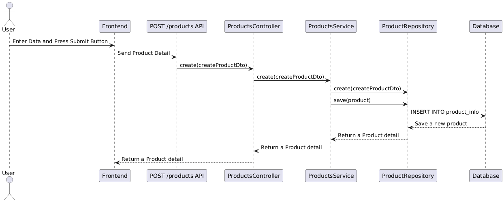

## การติดตั้งและใช้งาน NestJS

### 1. ติดตั้ง NestJS CLI

ติดตั้ง CLI ของ NestJS แบบ global ด้วย npm:
```bash
npm install -g @nestjs/cli
```

### 2. สร้างโปรเจกต์ใหม่

สร้างโปรเจกต์ใหม่ด้วย CLI:
```bash
nest new my-nest-app
```
(เปลี่ยนชื่อ my-nest-app เป็นชื่อโปรเจกต์ที่ต้องการ)

เข้าไปในโฟลเดอร์โปรเจกต์:
```bash
cd my-nest-app
```

### 3. รันเซิร์ฟเวอร์ NestJS

เริ่มเซิร์ฟเวอร์สำหรับพัฒนา:
```bash
npm run start:dev
```

---

### 4. สร้าง resource สำหรับ products

สร้าง resource (controller, service, module) สำหรับ products:
```bash
nest g resource products
```

### 5. ติดตั้ง dependencies ที่จำเป็น

- สำหรับ validation form:
```bash
npm install class-validator class-transformer
```

- สำหรับเชื่อมต่อ PostgreSQL ด้วย TypeORM:
```bash
npm install --save @nestjs/typeorm typeorm pg
```

---

### 6. เปิดใช้งาน CORS (สำคัญสำหรับเชื่อมต่อ API จาก frontend)

**ก่อนจะ get API จาก Next.js หรือ frontend อื่น ต้องเปิด CORS ใน main.ts:**

```typescript
// main.ts
import { NestFactory } from '@nestjs/core';
import { AppModule } from './app.module';

async function bootstrap() {
  const app = await NestFactory.create(AppModule);
  app.enableCors();
  await app.listen(Port); 
}
bootstrap();
```

**ถ้าไม่เปิด CORS จะ fetch API จาก frontend ไม่ได้**

---

### สรุป package ที่ใช้

- @nestjs/core, @nestjs/common, @nestjs/cli
- @nestjs/typeorm, typeorm, pg
- class-validator, class-transformer

---

### หมายเหตุ

- ต้องมี PostgreSQL ติดตั้งและสร้าง database ก่อนใช้งาน
- เปิดใช้งาน CORS ทุกครั้งที่ต้องการเชื่อมต่อ API จาก frontend

---

### ตัวอย่าง Flow ของ CRUD: Create Product

1. **Frontend**  
   - ผู้ใช้กรอกข้อมูลสินค้าใหม่ในหน้า Add Product แล้วกด submit  
   - ส่ง HTTP POST มาที่ API `/products` พร้อมข้อมูลสินค้า

2. **Controller** (`products.controller.ts`)  
   - รับ request ที่ฟังก์ชัน `create(@Body() createProductDto: CreateProductDto)`  
   - เรียกใช้ service: `this.productsService.create(createProductDto)`

3. **Service** (`products.service.ts`)  
   - ฟังก์ชัน `create(createProductDto: CreateProductDto)`  
   - สร้าง entity ใหม่ด้วย repository:  
     `const product = this.productRepository.create(createProductDto);`  
   - บันทึกลง database:  
     `return await this.productRepository.save(product);`

4. **Module** (`products.module.ts`)  
   - เชื่อมโยง controller, service, และ entity ผ่าน TypeORM

5. **Database**  
   - TypeORM จะ map entity ไปยัง table ใน PostgreSQL  
   - ข้อมูลสินค้าถูกบันทึกลง table `product_info`



**สรุป Flow:**  
- Frontend → Controller (`create`) → Service (`create`) → Repository (`create`, `save`) → Database

**ตัวอย่างชื่อฟังก์ชันแต่ละไฟล์:**  
- Controller: `create`  
- Service: `create`  
- Repository: `create`, `save`